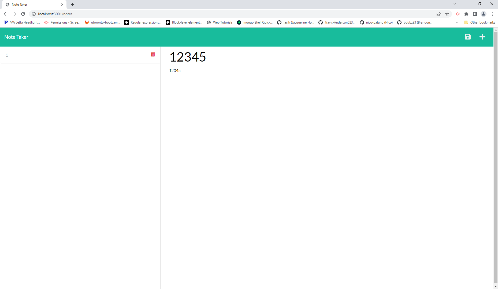

# Note Taker 

## Description

### What does Note Taker do?

Front end was provided by the bootcamp, our job was to create the server-side routes to work with the provided files to make the app work. The completed project allows users to write save and delete notes.


## Table of Contents

- [Installation](#installation)
- [Usage](#usage)
- [Credits](#credits)
- [Contribution](#contribution)
- [Questions](#questions)
- [Licence](#licence)

---

## Installation 

### Technologies Used in Development

Technologies used include:

The express npm package was used to set up the routes, and the uuid npm package was used to generate ID's for each note.

### Installation Instructions

```md
deployed at https://express---note-taker.herokuapp.com/
otherwise
clone the repo and run npm install in the terminal
```

## Usage



```md
npm run start in terminal once everything is installed
```

## Credits

Credit goes to bootcamp for the front end, and me for the routing.

## Contribution

Guidelines for contribution:

No contribution.

## Questions

No contact.

https://github.com/jq67


---
## Licence
This project is covered under the `Mit License`
